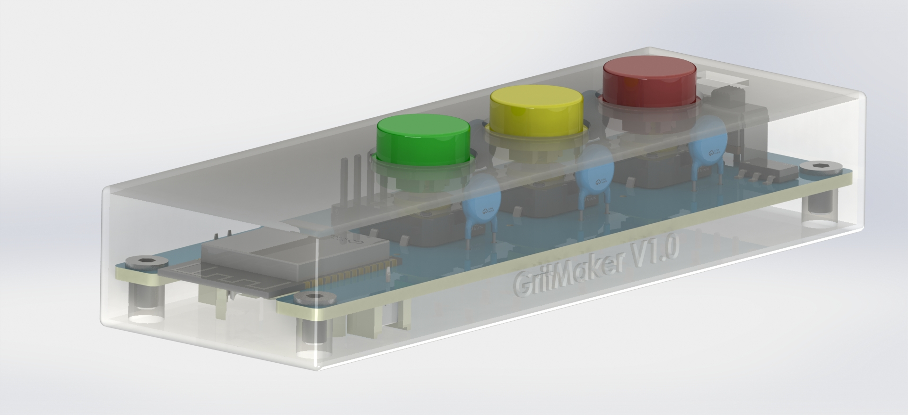
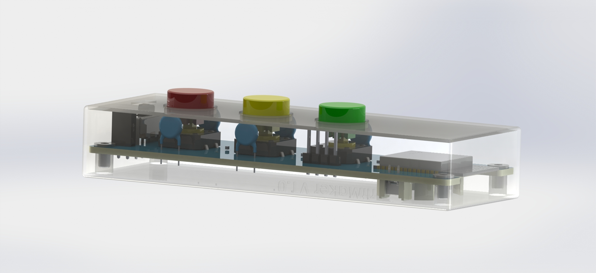
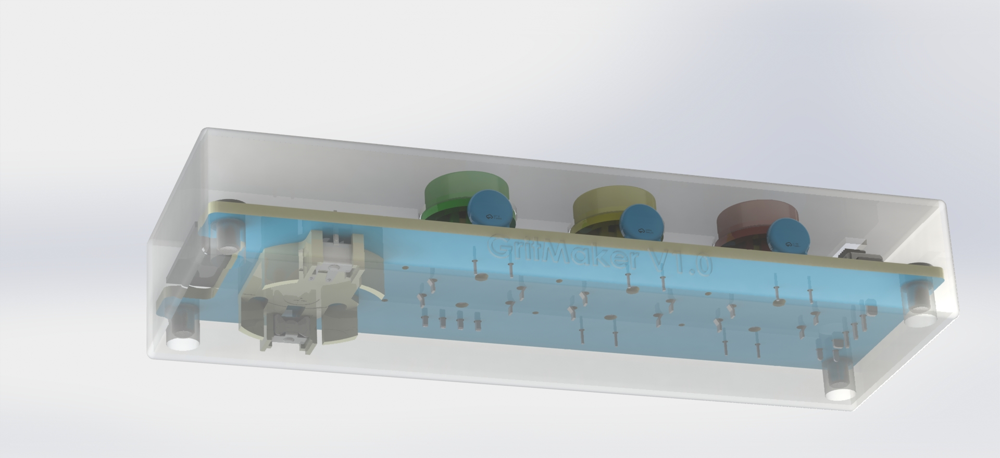

# GritMaker

GritMaker is a revolutionary educational tool inspired by Angela Duckworth's Grit book. It combines AI-driven classroom quiz automation with personalized learning experiences to cultivate grit in students.

## Technologies Used

- **Languages:**
  - Python (Django)
  - JavaScript (ReactJS, TypeScript, NextJS)
  - SQL (PostgreSQL)
  - C++ (PlatformIO, ESP32)

- **Frameworks:**
  - Django
  - ReactJS
  - NextJS

- **Platforms:**
  - ESP32 (PlatformIO)

- **Cloud Services:**
  - Azure Cloud Services

- **Database:**
  - Azure PostgreSQL Service

- **PCB Design:**
  - Open Source Hardware Lab, EasyEDA Pro

## Render Gallery

## PCB Layouts & Circuit

## How to Run

- Clone the repository
- Set up the Django backend with PostgreSQL database
- Configure and run the ESP32 in PlatformIO
- Start the ReactJS frontend with NextJS

## Features

- Breakout Questions: AI dynamically groups students and tailors quizzes based on performance data.
- Personalized Learning: Promotes individualized learning experiences for enhanced engagement.
- Grit Cultivation: Beyond traditional assessments, empowering students to develop grit through targeted challenges.

## Getting Started

1. Install dependencies for Django, ReactJS, and PlatformIO.
2. Configure database settings in Django.
3. Run Django backend, ESP32 in PlatformIO, and ReactJS frontend.
4. Access the application and start experiencing the future of education!
### Step 1: Clone the Repository

`bash`

`git clone https://github.com/enkhbold470/grit-maker.git`

`cd grit-maker`

### Step 2: Set up Django Backend

Open the **back-end** directory in your IDE.

Install Python and pip if not already installed.

__Create a virtual environment:__

`bash`

`python -m venv venv`

__Activate the virtual environment:__

On Windows:

`bash`

`.\venv\Scripts\activate`

On Unix or MacOS:

`bash`

`source venv/bin/activate`

__Install Django and other dependencies:__

`bash`

`pip install -r requirements.txt`

__Apply migrations and create the database:__

`bash`

`python manage.py migrate`

__Run the Django development server:__

`bash`

`python manage.py runserver`

### Step 3: Configure and Run ESP32 in PlatformIO

    Install PlatformIO extension for Visual Studio Code or your preferred IDE.

    Open the Firmware-codebase directory in your IDE.

    Configure the ESP32 settings in `platformio.ini.`

    Build and upload the code to your ESP32 device.

### Step 4: Start ReactJS Frontend with NextJS

Navigate to the frontend directory:

    bash

    cd frontend

    Install dependencies:

    bash

    npm install

    Run the ReactJS app:

    bash

    npm run dev

### Step 5: Access the Application

Open your web browser and go to http://localhost:3000 to access the GritMaker application.

### Step 6: Experience the Future of Education!

Explore the features of GritMaker, including Breakout Questions and personalized learning experiences.

## Contributing

Feel free to contribute by opening issues or submitting pull requests. Your input is highly valued!

## License

This project is licensed under the [MIT License](LICENSE).
